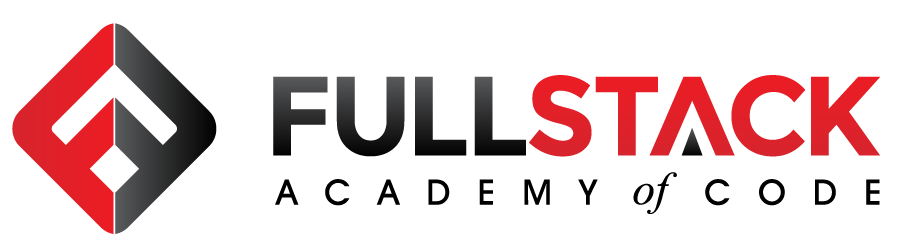
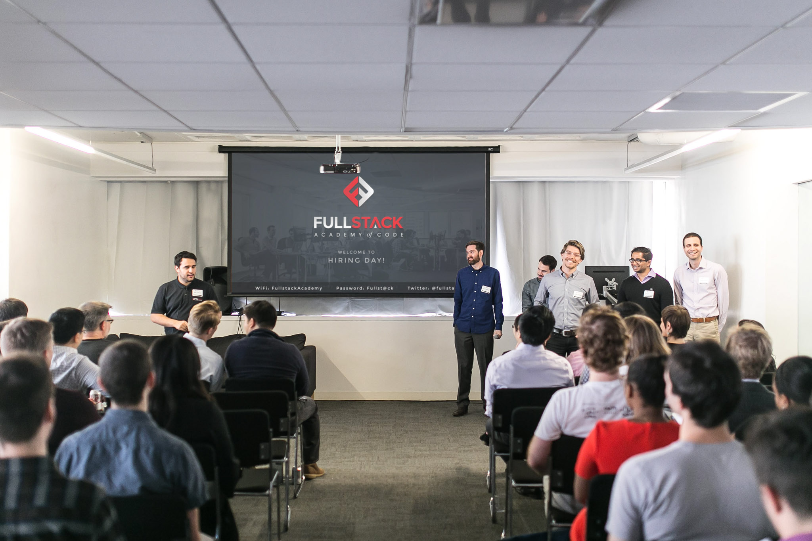
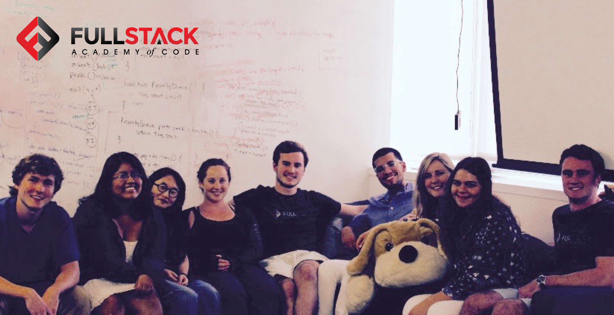
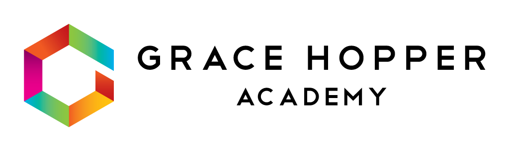
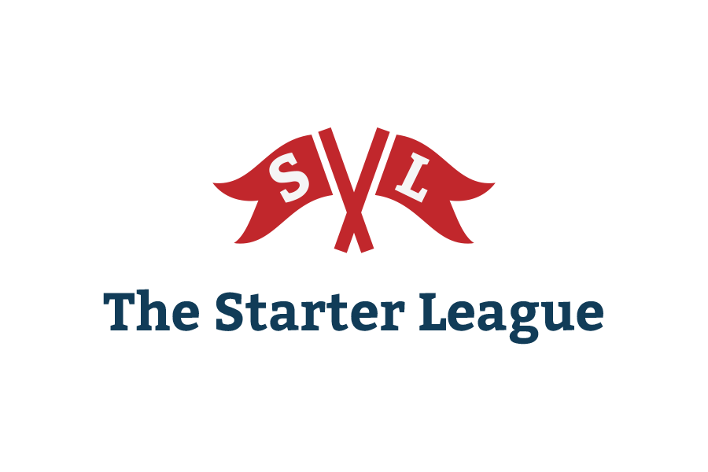
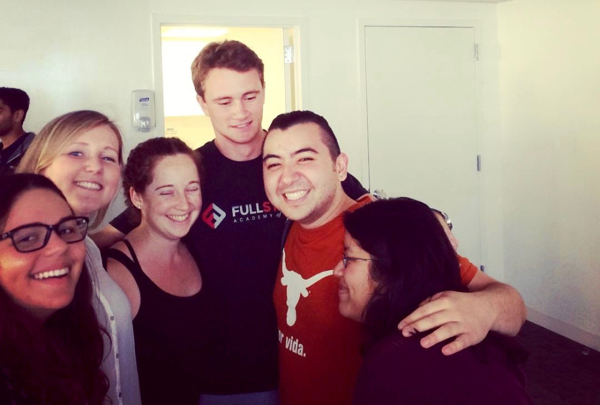

# fullstack-me

   

Resources for getting into [Fullstack Academy](http://fullstackacademy.com). 📚

As an ambassador for Fullstack Academy, I want to create a hub of resources that any potential Fullstack Academy student can benefit from.

As a alumnus of Fullstack Academy myself, I just want to create something that would have been useful to me when I was applying.

## Table of Contents

- [Programs Available](#programs-available) 🎉
    + [My Personal Journey](#my-personal-journey) 🍓
- [Research](#research) 🔍
    + [Reviews](#reviews) ⭐⭐⭐⭐⭐
    + [Helpful Tips](#helpful-tips) 📌
    + [Cool Articles](#cool-articles) 📰
- [Preparing](#preparing) 📚
    + [Resources to Just Learn](#resources-to-just-learn) 🎒
- [Pricing](#pricing) 💸
    + [Housing Options](#housing-options) 🏠
- [Contributing](#contributing) 👥
- [Credits](#credits) ©

## [Programs Available](#programs-available) 🎉

Fullstack Academy has expanded **A LOT** since first launching in 2012, with campuses in both NYC and Chicago.

Their primary and most popular program is still the [Software Engineering Immersive](https://www.fullstackacademy.com/software-engineering-immersive) which runs for 17 weeks total with 4 weeks involving remote learning.

For those who want to do the program part-time on campus, there's the [Flex Immersive](https://www.fullstackacademy.com/flex-immersive) option which is a total of 32 weeks and operates through week-night classes with plenty of remote lecture and project time.

Or for those who don't have the chance to be on campus at all, there's the [Remote Immersive](https://www.fullstackacademy.com/remote-immersive) option which is basically the same as the Software Engineering Immersive but entirely online.

In the summer of 2015, Fullstack started offering the [Summer of Code](https://www.fullstackacademy.com/summer-of-code) program which is an 11-week coding immersive for college students in NYC and Chicago. I was part of the first batch!

In early 2016, Fullstack launched [Grace Hopper Academy](https://www.gracehopper.com/) which opened as a parallel program to the Software Engineering Immersive at Fullstack and is one of the few immersive software engineering courses for women with no upfront tuition cost.

Also, in early 2016, Fullstack acquired [Starter League](http://www.starterleague.com/) and expanded its campuses in Chicago.

To help students prepare for entering these rigorous programs, Fullstack Academy also started recently offering three different options:

- [Bootcamp Prep](https://www.fullstackacademy.com/bootcamp-prep) (on-campus or online)
    + 4 week program that guarantees admission to a top coding bootcamp
- [JavaScript Jumpstart](https://www.fullstackacademy.com/jumpstart-online) (only online)
    + online course covering the basics of JavaScript
- [JavaScript 101](https://www.fullstackacademy.com/javascript-101) (on-campus or online)
    + 2 to 3 hour modules designed to help students start learning the basics of JavaScript

It should be noted all these programs are offered in both campuses (NYC and Chicago) with the exception of Grace Hopper which just operates in NYC.

### [My Personal Journey](#my-personal-journey) 🍓

I graduated from the inaugural class for Fullstack Academy's [Summer of Code](https://www.fullstackacademy.com/summer-of-code) program in 2015 and I definitely **loved** my experience. 😍

Since graduating, I've gone on to have interviews and speak at conferences about my experience as well as have my content circulated to Fullstack Academy students.

Here are some other creations of mine related to my time at Fullstack and afterwards.

-  [My Fullstack Academy Experience - Blog Posts](https://fvcproductions.com/2015/08/30/fullstack-academy-reflections/)
-  [Interview Experience with Various Coding Bootcamps - Blog Posts](https://fvcproductions.com/2016/03/31/all-the-bootcamp-things)
-  [Interview on Fullstack Academy Experience - Course Report](https://www.coursereport.com/schools/fullstack-academy#/news/alumni-spotlight-frances-coronel-of-fullstack-summer-of-code)
-  [Review for Fullstack Academy - Course Report](https://www.coursereport.com/schools/fullstack-academy?page=2#/reviews/review/2133)
-  [Awesome Web Dev Tips & Tricks - Slide Deck](https://speakerdeck.com/fvcproductions/awesome-web-dev-tips-and-tricks)
    +  Last I heard, this is actually shared with students in the beginning of the course!
- [The State of Coding Bootcamps 2017 - Slide Deck](https://speakerdeck.com/fvcproductions/the-state-of-coding-bootcamps-2017)
- [JS Coding Bootcamps - Slide Deck](https://speakerdeck.com/fvcproductions/js-coding-bootcamps-norfolk-dot-js)
-  [Summer of Code Experience - Slide Deck](https://speakerdeck.com/fvcproductions/my-fullstack-academy-summer-of-code-experience)
-  [Web Design Tech Talk - Slide Deck](https://speakerdeck.com/fvcproductions/web-design-tech-talk)

## [Research](#research) 🔍

The first step in making sure Fullstack Academy is the right choice for you is by doing your research!

**So ask yourself...** 🤔

- What are you hoping to get out of this program?
    - Are you willing to dedicate 4 months of your time to learning how to code on a professional level?
    - Do your career goals align with the aftermath of this program?

> A coding bootcamp is not a light decision given that it requires a huge time and financial investment. Make sure you're doing this for the right reasons!

- How much coding have you learned so far?
    - What have you been using to teach yourself how to code thus far?
    - Have you attended any [hackathons](http://nyhackathons.com/) , tech [Meetups](https://www.meetup.com/find/tech/?allMeetups=false&radius=50&userFreeform=New+York%2C+NY&mcId=z10011&mcName=New+York%2C+NY&sort=member_count&eventFilter=mysugg) , or conferences related to web development or the tech industry?
    - Are you sharing any technical achievements online?
    - How prepared do you feel for the technical interview?
    - Have you practiced solving any coding problems?

> If you still don't know how to implement a basic for loop, you haven't prepared enough. You have to show you have a passion for this field in one way or another. This makes sense because why would you dedicate 4 months to intense learning of the subject if you didn't like it?

> Also, the more high quality a coding bootcamp is, the typically more competitive it is as well so it's important to come prepared to tackle some lower level programming problems to show you're committed.

I would also recommend reaching out to [Fullstack alumni on LinkedIn](https://www.linkedin.com/school/15098574/alumni) and reading up on those reviews to get a better idea of where folks end up after graduating and whether or not they enjoyed the experience.

### [Reviews](#reviews) ⭐⭐⭐⭐⭐

> From across the interwebs!

-  [Quora](https://www.quora.com/What-is-your-review-of-Fullstack-Academy)
-  [Course Report](https://www.coursereport.com/schools/fullstack-academy)
-  [Yelp](https://www.yelp.com/biz/fullstack-academy-of-code-new-york)
-  [SwitchUp](https://www.switchup.org/bootcamps/fullstack-academy)
-  [Thinkful](https://www.thinkful.com/bootcamps/fullstack-academy)
-  [Facebook](https://www.facebook.com/FullstackAcademy/reviews)

### [Helpful Tips](#helpful-tips) 📌

- Don’t just apply to one program! Go ahead and use [Course Report](https://www.coursereport.com/) to find programs of all kinds and choose the ones that best suit your long-term goals.
- Avoid [being scammed](https://techcrunch.com/2016/06/25/students-are-demanding-the-facts-about-coding-bootcamps/) and do your research on the program you want to attend. Read reviews, reach out to alumni who come from a similar work/academic background as you, and look up the program on the news for any red flags. After all, you don’t want to pay all that money for nothing! It’s better to try harder and get into a more competitive program with a lower acceptance rate than settle for one that churns students out.
- If you’re not that familiar with the platform [GitHub](http://github.com/fvcproductions) (where you're reading this now), now is the time to make yourself **extra familiar** ! Regardless of which program you decide to enroll in, you will be probably end up using GitHub **a lot** as a developer. Create a profile and spice it up with open-source contributions or personal projects. A great starter project is a simple personal website [using GitHub pages](https://pages.github.com/) .
- Make sure to market yourself appropriately! Meaning, if you have done something outside of work that can highlighted as a technical achievement (contributed to open-source, completed a lot/all modules on a platform, top student in STEM major, etc.), make sure to share it online! The only way employers or interviewers can know about how passionate you are about coding is if you share this with them! I would recommend using LinkedIn or your personal website to showcase this kind of information.
- Don’t think you’re ready to become a developer? Then just start acting like one! Start attending [hackathons](http://nyhackathons.com/) , tech [Meetups](https://www.meetup.com/find/tech/?allMeetups=false&radius=50&userFreeform=New+York%2C+NY&mcId=z10011&mcName=New+York%2C+NY&sort=member_count&eventFilter=mysugg) , or conferences that are [friendly towards newbies](http://codelandconf.com/) .
- Being able to code is a little different from regular typing, so I’d recommend using a platform like [Typing.io](https://typing.io/) to help improve your current typing abilities. Faster and more accurate typing is like a better [REPL](http://en.wikipedia.org/wiki/Read%E2%80%93eval%E2%80%93print_loop) — not only does this speed up development, it fundamentally affects the exploration process.
- Similar to the tip above, if you know the way around your dev environment really well, you can get things done a lot faster. If you’re using [Sublime Text](https://www.sublimetext.com/) as your main text editor, I would take a look at [Sublime Tutor](https://sublimetutor.com/) which is an interactive in-editor keyboard shortcuts tutorial.

### [Cool Articles](#cool-articles) 📰

- [So that whole coding bootcamp thing is a scam, right?](https://medium.freecodecamp.com/so-that-whole-coding-bootcamp-thing-is-a-scam-right-6fddf14087d4?gi=cc8f0c2cd138#.2wzinpvaz)
- [I spent 3 months applying to jobs after a coding bootcamp. Here's what I learned.](https://medium.freecodecamp.com/5-key-learnings-from-the-post-bootcamp-job-search-9a07468d2331#.w0ilixnhp)
- [Comparing Salaries for Coding Bootcamps vs. Computer Science Degrees - Bloc Weekly](https://medium.com/bloc-posts/comparing-salaries-for-coding-bootcamps-vs-computer-science-degrees-5e735e75c6bc#.bywijxpqt)
- [How to get the most out of a coding bootcamp. - Women Who Code Community](https://medium.com/women-who-code-community/how-to-get-the-most-out-of-a-coding-bootcamp-77f5cadc7867#.8rpt58bfz)

## [Preparing](#preparing) 📚

First, take advantage of all the online resources Fullstack Academy recommends!

-  [Codecademy - JavaScript](https://www.codecademy.com/learn/javascript)
    - I would recommend completing all lessons for this track.
-  [Coderbyte](https://coderbyte.com/course/prepare-fullstack-academy)
    - You should be able to complete most easy problems and a few medium problems.
-  [Codewars](https://www.codewars.com/)
    - Again, you should be able to complete most easy problems (1 to 5 kyu) and a few medium problems (6 to 8 kyu).
-  [Coding Assessment Tutorial](http://istest.co/fullstack_tutorial)
    - Here you can get introduced to the online environment Fullstack Academy uses for the technical interview portion.
-  [Cracking the Coding Interview](http://www.crackingthecodinginterview.com/)
    - Find inspiration for coding challenges that tech companies love to use.
-  [Eloquent JavaScript](http://eloquentjavascript.net/)
    - It's recommended to read at least chapters 1 through 4.
-  [A Smarter Way to Learn JavaScript](http://www.asmarterwaytolearn.com/index.html)
    -  [Online Exercises](http://www.asmarterwaytolearn.com/js/index-of-exercises.html)

Check out [Quora’s Fullstack Academy topic](https://www.quora.com/topic/Fullstack-Academy) for even more!

Then once you feel like you've got some of that lingo down, start attending more [tech events](https://github.com/fvcproductions/tech-events) like [Meetups](http://meetup.com), hackathons, and conferences. You might end up learning something cool!

### [Resources to Just Learn](#resources-to-just-learn) 🎒

So obviously there are a [TON of free resources](https://www.producthunt.com/search/posts?q=learn%20to%20code) to help you learn to code online.

So **I’m going to exclude the ones I’ve mentioned already above** and just include free to use platforms that are more interactive and focus on technologies taught at Fullstack Academy.

-  [Code4Startup](https://code4startup.com/)
-  [CodeCombat](https://codecombat.com/)
-  [CodeUpStart](http://www.codeupstart.com/)
-  [Code School](https://www.codeschool.com/)
-  [Free Code Camp](https://www.freecodecamp.com/)

## [Pricing](#pricing) 💸

> As of March 2017, the overall prices for the programs are as follows.

- [Fullstack Academy Software Engineering Immersive](https://www.fullstackacademy.com/tuition-cohort-dates) $17,610
- [Summer of Code](https://www.fullstackacademy.com/summer-of-code#apply): $16,610
- [Bootcamp Prep](https://www.fullstackacademy.com/bootcamp-prep): $2,750
- [JavaScript Jumpstart](https://www.fullstackacademy.com/jumpstart-online): $49
- [JavaScript 101](https://www.fullstackacademy.com/javascript-101) $10 each

> They also offer several scholarships or refunds.

- Ada Lovelace Scholarship: $1,000
    + Automatic and only for women
- [Bootcamp Prep](https://www.fullstackacademy.com/bootcamp-prep): Refund of $1,500
    + Only if you complete this course and enroll in one of the pre-selected schools
- [Chicago Scholarship](https://www.fullstackacademy.com/scholarships/chicago-scholarship): $3000
    + Automatic and only for students entering programs in the Chicago campus
- [Remote Immersive Scholarship](https://www.fullstackacademy.com/scholarships/50-states-of-code)
    + Awarding partial and full scholarships for those who successfully complete the application

### [Housing Options](#housing-options) 🏠

> For once you get accepted! 😊

> As of March 2017, the starting prices for these are as follows.

-  [Airbnb](https://www.airbnb.com/s/Wall-Street--New-York--NY--United-States?guests=1&place_id=EihXYWxsIFN0cmVldCwgTmV3IFlvcmssIE5ZLCBVbml0ZWQgU3RhdGVz&checkin=06%2F04%2F2017&checkout=08%2F25%2F2017&ss_id=leu0phvj&source=bb&page=1&s_tag=H2_hmzIz&allow_override%5B%5D=)
    - varies
-  [Common](https://www.common.com/)
    - starts at $2,050/month
-  [Founder House](https://www.founder.house/)
    - starts at $1,050/month
-  [Krash](https://krash.io/)
    - starts at $1,900/month
-  [NYU Summer Housing](https://www.nyu.edu/summer/housing/)
    - starts at $1,400/month
-  [WeLive](https://www.welive.com/)
    - starts at $1,900/month
- Subletting an apartment short-term
    -  [Craigslist](https://newyork.craigslist.org/search/aap)
    -  [The Listings Project](https://www.listingsproject.com/)
- Crashing with family or friends
    + Yeah, this is what I did. 😂

## [Contributing](#contributing) 👥

> To get started...

- 🍴 Fork this repo [here](https://github.com/fvcproductions/readme#fork-destination-box)
- 🔨 Hack away
- 👥 Add yourself as a contributor under credits
- 🔧 Make a pull request [here](https://github.com/fvcproductions/fullstack-me/compare)
- 🎉 Get your pull request approved - success!

Or just [create an issue](https://github.com/fvcproductions/fullstack-me/issues) - any little bit of help counts! 😊

## [Credits](#credits) ©

- [FVCproductions](http://fvcproductions.com) 🍓🍫